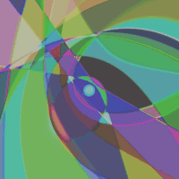
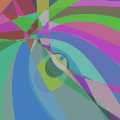

>#  artsificial


## Generating art with neural networks

This project uses the [OpenVINO™ toolkit](https://docs.openvinotoolkit.org/) to deploy a deep learning solution for Art Generation 
with Compositional Pattern Producing Networks, while exploring the possibilities for the different patterns and color palettes that 
can be produced.

### Introduction

[Compositional Pattern Producing Networks](https://en.wikipedia.org/wiki/Compositional_pattern-producing_network) (CPPNs) are a variation of Artificial Neural Networks with an architecture based in mathematical functions and guided by genetic algorithms.
CPPNs may include many more functions than only Sigmoid and Gaussian and the choice of applied functions can be biased towards different types of produced patterns and regularities. For example, Linear functions can be applied in order to produce linear or fractal-like patterns.
Furthermore, neuroevolution techniques like Neuroevolution of Augmented Topologies (NEAT) can be applied to evolve CPPNs.


### Project's story

All of us had the chance to be selected for the Intel® Edge AI Scholarship Challenge at Udacity.
Before that we had won the Secure and Private AI Scholarship Challenge by Facebook AI and were selected for a follow up 
Nanodegree Scholarship at Udacity, during which we successfully graduated from the Computer Vision Nanodegree.

During the Intel® Edge AI Scholaship Challenge, along with other scholars from the Secure and Private AI Scholarship, we formed a study group on Slack and kept communicating and sharing ideas, resources and concerns.

After the announcement for the [Project Showcase Challenge](https://sites.google.com/udacity.com/intel-edge-ai-scholarship/community/project-showcase?authuser=0), we started exploring the idea of creating a project in the Arts category.
A source of inspiration was the [Computer Vision Art Gallery](https://computervisionart.com/), along with some other impressive projects of Contemporary Art which use AI.

We were fascinated by the Compositional Pattern Producing Networks and, since we didn't have any previous experience, we started learning more about them from the published resources, while exploring their possibilities. Finally, we agreed to use as a base source a [PyTorch implementation of a CPPN](https://github.com/jtguibas/cppn-art), and modify it according to our desired outputs.


### Tests & Example Outputs

#### Model 1	
<table>	
  <tr>	
    <td align="center">	
        	
        Sample 1: Greyscale<br>Scale: 0.1	
    </td>	
    <td align="center">	
        	
        Sample 2: Enhanced B&W<br>Scale: 0.1	
    </td>	
    <td align="center">	
        	
        Sample 3: RGB Palette<br>Scale: 0.3	
    </td>	
    <td align="center">	
        	
        Sample 4: High Resolution<br>Scale: 0.8	
    </td>	
  </tr>	
</table>

#### Model 2	
<table>	
  <tr>	
    <td align="center">	
        	
        Sample 1: 15 FPS<br>Scale: 0.3	
    </td>	
    <td align="center">	
        	
        Sample 2: 15 FPS<br>Scale: 0.3	
    </td>	
    <td align="center">	
        	
        Sample 3: 30 FPS<br>Scale: 0.1	
    </td>	
    <td align="center">	
        	
        Sample 1: 30 FPS<br>slow-change	
    </td>	
  </tr>	
</table>	

### Future Plans

We would like to work further on the improvement of the project and use it for artistic installations. One big goal could be to produce generative images on Raspberry Pi in real time.


## Getting Started

In order to get a copy of this project up and running on your local machine for development and testing purposes, please follow the instructions below.

### Prerequisites

#### For Windows 10

* Microsoft Visual Studio* with C++ 2019, 2017, or 2015 with MSBuild
* CMake 3.4 or higher 64-bit
* Python 3.6.5 64-bit

### Installation

* Install the respective Intel® Distribution of OpenVINO™ toolkit for Windows 10 / Mac OS / Linux, following all the required steps on the [documentation guide](https://docs.openvinotoolkit.org/latest/index.html).

## How to run the project

* setup the environment variables to run the openVINO application
```
source /opt/intel/openvino/bin/setupvars.sh
```
* command line arguments
```
usage:
Run inference [-h] --model MODEL [--device DEVICE] [---fps FPS][seconds SECONDS] 
[--img_size IMG_SIZE] [--scale SCALE] [--pattern_change_speed PATTERN_CHANGE_SPEED][--save_frames]

required arguments:
--model MODEL                                   The location of the model XML file
--device DEVICE                                 The devices on which the inference should be performed [CPU, GPU, FPGA, MYRIAD, HETERO:CPU,GPU]

optional arguments:
--fps FPS                                       Number of Frames Per Second for the video
--seconds SECONDS                               The duration of the video in seconds
--img_size IMG_SIZE                             The width or height for the frame to be generated
--scale SCALE                                   Scale factor for inputs
--pattern_change_speed PATTERN_CHANGE_SPEED     The rate of flow/change of the pattern
--save frames                                   Save the individual frame generated as PNG images
```

* Sample commands for running

With the compulsory argument:
```
python ppn_app.py --model "models\ppn-model-2.xml" --device HETERO:CPU,GPU
```

With the optional arguments:
```
python ppn_app.py --model "models\ppn-model-2.xml" --device HETERO:CPU,GPU --fps 15 --seconds 15 --scale 0.2 --pattern_change_speed 0.6 --save_frames
```

## Implementation on Raspberry Pi + Intel NCS2

For running the code on Raspberry Pi combined with Intel NCS2 the following line has to be changed:
```
plugin.load_model("models/ppn-model-1.xml", "MYRIAD") #was "CPU"
```
* ```torch.onnx.export()``` does not work on Raspberry Pi.
* Due to a known error (https://software.intel.com/en-us/node/849460) in version 2020.1 the models must be converted to the previous version of IR format: '--generate_deprecated_IR_V7'.
* The generated .avi files from notebook [4 - Model 2 - Inference.ipynb](https://github.com/subrockmann/artsificial/blob/master/4%20-%20Model%202%20-%20Inference.ipynb) are running on Windows but not on Raspberry Pi.


## Overview

* [1 - Generate Arts.ipynb](https://github.com/subrockmann/artsificial/blob/master/1%20-%20Generate%20Arts.ipynb)<br/>
This notebook provides a visual introduction to the generative process and the different parameters.
* [2 - Generate Model 2.ipynb](https://github.com/subrockmann/artsificial/blob/master/2%20-%20Generate%20Model%202.ipynb)</br>
This notebook suggests a different approach for the Network's Architecture, which ends up to a different color palette and pattern production.
* [3 - Model 1 - Inference.ipynb](https://github.com/subrockmann/artsificial/blob/master/3%20-%20Model%201%20-%20Inference.ipynb)</br>
This notebook contains the required libraries and code to perform Inference on the first Model.
* [4 - Model 2 - Inference.ipynb](https://github.com/subrockmann/artsificial/blob/master/4%20-%20Model%202%20-%20Inference.ipynb)</br>
This notebook contains the required libraries and code to perform Inference on the second Model.
* [5 - Code exploration and alternative algorithms.ipynb](https://github.com/subrockmann/artsificial/blob/master/4%20-%20Code%20exploration%20and%20alternative%20algorithms.ipynb)<br/>
This notebook contains code that helps to understand the basic algorithm used in notebook 1 and explores a different algorithm for generative art.

## Built with

* [PyTorch](https://pytorch.org/) - For AI model development
* [ONNX](https://onnx.ai/) - To convert the model for use with the Inference Engine
* [OpenVINO™ toolkit](https://docs.openvinotoolkit.org/) - For the application development


## Contributing

Please read [CONTRIBUTING.md](CONTRIBUTING.md) for details on our code of conduct, and the process for submitting pull requests to us.

## Authors

>[Evi Giannakou](https://github.com/evigian),
>[Susanne Brockmann](https://github.com/subrockmann),
>[Kapil Chandorikar](https://github.com/kapilchandorikar)

> Connect with us on LinkedIn

## License

This project is licensed under the MIT License - see the [LICENSE.md](https://github.com/subrockmann/artsificial/blob/master/LICENSE.md) file for details

## Acknowledgements

* [Intel® Edge AI Scholaship Program](https://www.udacity.com/scholarships/intel-edge-ai-scholarship) at Udacity, for the chance to study within an amazing community.
* [Mariia Denysenko](https://github.com/MariiaDen), for the administration of the #sg_spaic and the presentation of CPPNs to the study group.
* [John Guibas](https://github.com/jtguibas), for his PyTorch implementetion of CPPNs.


## References

* [Kenneth O' Stanley, Compositional Pattern Producing Networks: A Novel Abstraction of Development](https://eplex.cs.ucf.edu/papers/stanley_gpem07.pdf)
* [Mattie Tesfaldet, Xavier Snelgrove, David Vazquez, Fourier-CPPNs for Image Synthesis](https://arxiv.org/pdf/1909.09273.pdf)
* [David Ha, Generating Abstract Patterns with TensorFlow](http://blog.otoro.net/2016/03/25/generating-abstract-patterns-with-tensorflow/)
* [Neuroevolution](https://en.wikipedia.org/wiki/Neuroevolution)
